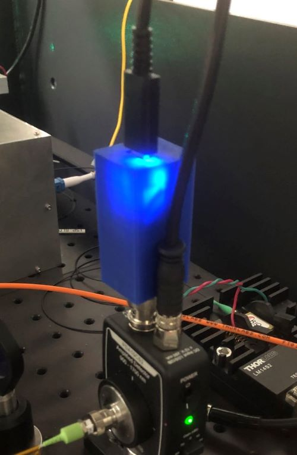

# Simple-digitizer

Single channel simple digitizer using Seeduino Xiao. The voltage input to the BNC connector can be read by a PC through a USB cable.

- STL files for 3D printing
  - BN-Xiao-BNC-side.stl
  - BNC-Xiao-MiconBoard-side.stl
- Origiinal FreeCAD file
  - BNC-Xiao.FCStd

